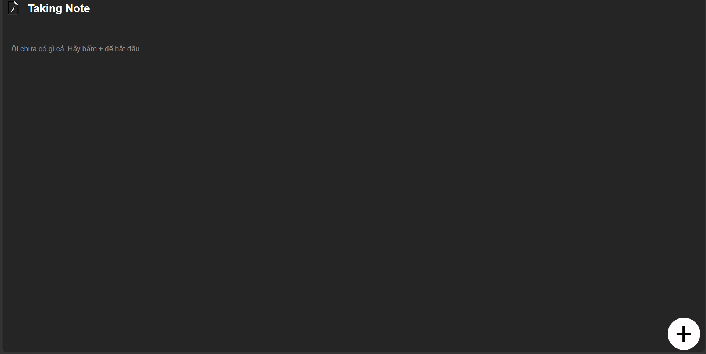
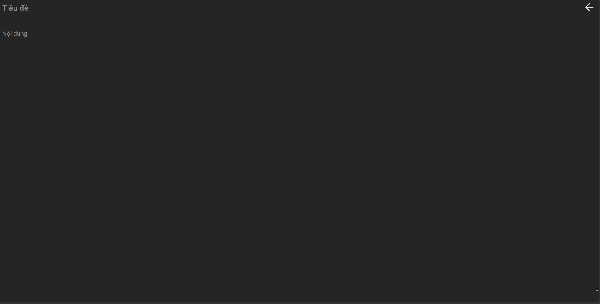
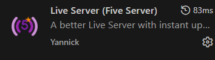
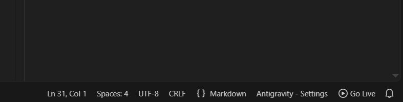

# Dự án Taking-Note
## Tổng quan
Taking Note là một web ghi chú hoạt động trong phạm vi trình duyệt. Người dùng có thể tạo, chỉnh sửa và xóa các ghi chú ở trong trình duyệt của mình

[Bấm vào đây để truy cập vào trang web](https://phucthg02394.github.io/Taking-Note/)
## Demo


## Ảnh chụp giao diện
<figure>
    
    <figcaption>Trang chủ</figcaption>
</figure>
<figure>
    
    <figcaption>Phần ghi chú</figcaption>
</figure>

## Hướng dẫn cài dự án
Bước 1: Sử dụng một trong hai lệnh sau:
```bash
git clone https://github.com/phucthg02394/Taking-Note.git
```
hoặc 
```bash
git clone git@github.com:phucthg02394/Taking-Note.git
```
Bước 2: Cài đặt Live Server Extension nếu chưa có



Bước 3: Vào dự án và bấm vào Go Live

